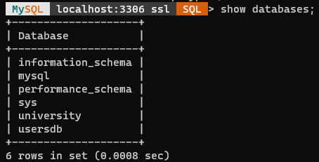
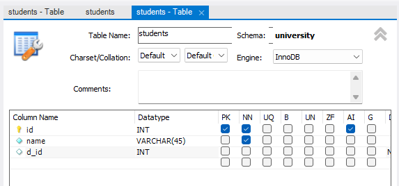
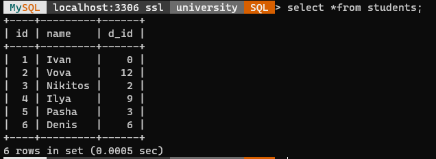
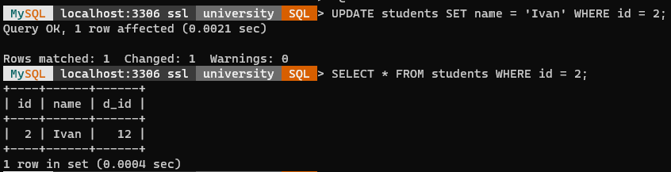
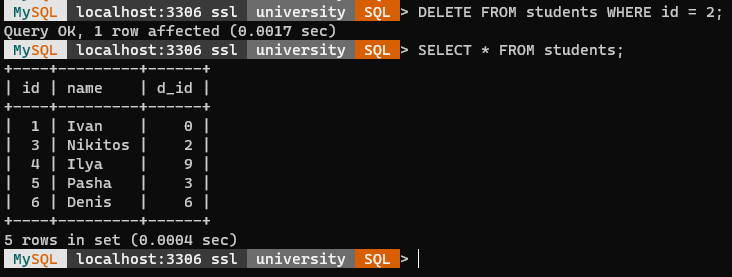

МИНИСТЕРСТВО НАУКИ И ВЫСШЕГО ОБРАЗОВАНИЯ
РОССИЙСКОЙ ФЕДЕРАЦИИ
ФЕДЕРАЛЬНОЕ ГОСУДАРСТВЕННОЕ БЮДЖЕТНОЕ
ОБРАЗОВАТЕЛЬНОЕ УЧРЕЖДЕНИЕ ВЫСШЕГО ОБРАЗОВАНИЯ
«САХАЛИНСКИЙ ГОСУДАРСТВЕННЫЙ УНИВЕРСИТЕТ»

 

Институт естественных наук и техносферной безопасности

Кафедра информатики

Пашаян Самвел Алексанович

 

Лабораторная работа №10

01.03.02 Прикладная математика и информатика

 

Научный руководитель

Соболев Евгений Игоревич

Южно-Сахалинск

2022 г.

<b>ВВЕДЕНИЕ</b>

 <b> PHP  </b> (рекурсивный акроним словосочетания PHP: Hypertext Preprocessor) - это распространённый язык программирования общего назначения с открытым исходным кодом.

 Вместо рутинного вывода HTML-кода командами языка (как это происходит, например, в Perl или C), скрипт PHP содержит HTML с встроенным кодом (в нашем случае, это вывод текста "Привет, я - скрипт PHP!"). Код PHP отделяется специальными начальным и конечным тегами <?php и ?>, которые позволяют "переключаться" в "PHP-режим" и выходить из него.
Код PHP отделяется специальными начальным и конечным тегами <?php и ?>, которые позволяют "переключаться" в "PHP-режим" и выходить из него.

## 
 РЕШЕНИЕ ЗАДАЧ (ОСНОВНАЯ ЧАСТЬ) 

Сперва я создал базу данных `«university»` в программе-дизайнере `MySQL Workbench`.

В базе данных `«university»` создал таблицу `«students»`.

Затем активизировал базу данных `«university»` (команда `use`).
Выполил SQL команду: `SELECT * FROM students;`

Выполнение SQL команды:

- `UPDATE students SET name = ‘Ivan’ WHERE id = 2;`
- `SELECT * FROM students WHERE id = 2;`

Выполнение SQL команды:

- `DELETE FROM students WHERE id = 2;`
- `SELECT * FROM students;`

 ВЫВОД 

 Итогом работы стало создание странички с использованием языка PHP. В ходе выполнения задания, мною были решены все выдвинутые задачи, сформулированные исходя из цели лабораторной работы, вспомнил как работать с СУБД MySQL, научился работать в программе MySQL Workbench, поработал с MySQL в консоли.
